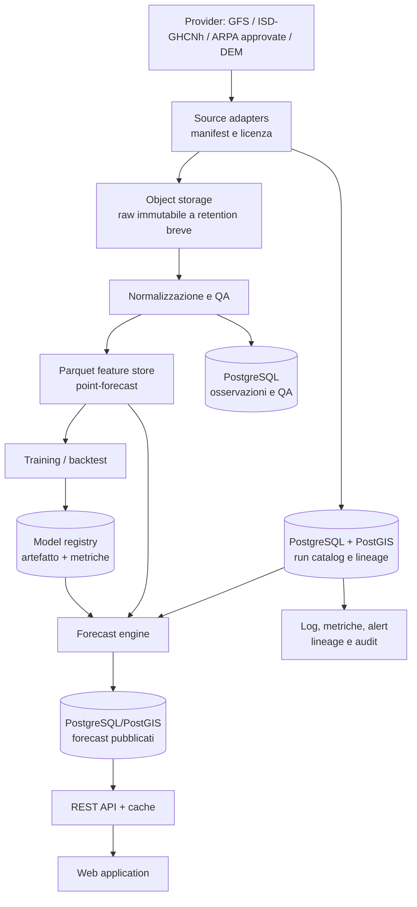

# Architettura di riferimento — Fase 4

Stato: decisione architetturale per MVP e crescita controllata. Non è ancora una specifica di implementazione né autorizza il download massivo di dati.

## Decisione

Adottare un **modular monolith data platform**: un singolo deployment applicativo pianificato, PostgreSQL con PostGIS per metadati e prodotto API, object storage S3-compatible per file, Parquet per training point-forecast. I componenti comunicano attraverso contratti dati e tabelle di stato, non con una piattaforma di streaming.

Questo è sufficiente per una run/die e un backfill limitato; conserva le interfacce necessarie per estrarre worker, registry ML e API in seguito.



## Componenti e responsabilità

| Componente | Tecnologia MVP | Responsabilità | Non responsabilità |
| --- | --- | --- | --- |
| Source adapters | Processi pianificati, uno per provider | Discovery file, download idempotente, checksum, licenza e `publication_time` | Trasformazioni ML |
| Object storage | Filesystem locale nella prova; S3-compatible in produzione | Raw, manifest, dataset versionati e backup | Query applicative per località |
| Catalogo | PostgreSQL 16+ con PostGIS | Run, file, qualità, licenza, stazioni, lineage e stato pipeline | Copiare ogni campo grigliato |
| Normalizzazione | Worker batch containerizzato | GRIB/CSV/HDF → schema canonico, unità, coordinate, QA | Pubblicare forecast senza validazione |
| Feature store | Parquet ZSTD, partizionato | Dataset point-forecast e snapshot di train/validation/test | Stato transazionale online |
| Array grigliati | Zarr, solo quando servono campi su griglia/radar | Accesso chunked a dataset multidimensionali | Sostituire Parquet per record stazione-lead |
| Training e backtest | Job batch separato | Fit, report, artefatti immutabili | Usare dati successivi al cutoff |
| Model registry | Tabella PostgreSQL + object storage in MVP | Versione, training window, dataset snapshot, metriche, checksum | Feature serving generico |
| Forecast database | PostgreSQL/PostGIS | Forecast locale/orario, incertezza e provenienza | Raw storage e training lake |
| API e cache | REST stateless + Redis opzionale | Query per località, cache, rate limit, API key futura | Calcolo NWP o training |

Parquet è un formato colonnare con supporto a compressione; Zarr memorizza array N-dimensionali compressi e chunked. Sono quindi complementari, non alternative concorrenti. [Parquet](https://parquet.apache.org/), [compressione Parquet](https://parquet.apache.org/docs/file-format/data-pages/compression/), [Zarr](https://zarr.readthedocs.io/en/v2.10.2/index.html).

## Contratto dati e lineage

Ogni artefatto deve avere un `dataset_version_id`; nessuna tabella/oggetto viene sovrascritto in posto.

| Entità | Chiave / contenuto minimo |
| --- | --- |
| `source_dataset` | provider, dataset, URL, licenza, attribuzione, policy retention |
| `forecast_run` | provider, model/version, `run_time_utc`, `publication_time_utc`, stato, checksum manifesto |
| `raw_object` | URI, ETag/checksum, bbox, variabili, valid time range, dimensione, retention expiry |
| `station` / `sensor_epoch` | fonte, coordinate, quota, strumento/variabile, inizio/fine, licenza |
| `observation` | station/sensor epoch, intervallo UTC, valore, unità, `qa_level`, revision time |
| `feature_snapshot` | contratto schema, upstream run/observation IDs, split, checksum, Parquet URI |
| `model_version` | codice, parametri, feature schema, snapshot train, metriche validation/test, approvazione |
| `published_forecast` | località, issue time, valid interval, model version, valore, intervallo/quantile, provenienza |

L’invariant fondamentale è: un `published_forecast` deve poter essere ricostruito dal suo `model_version`, `feature_snapshot` e `forecast_run`. Se questo non è possibile, non è pubblicabile come forecast Nimbus.

## Stato e idempotenza della pipeline

```text
DISCOVERED → DOWNLOADING → VERIFIED → NORMALIZED → FEATURED → ELIGIBLE → PUBLISHED
                         ↘ FAILED_RETRYABLE / FAILED_FINAL / QUARANTINED
```

- Chiave di idempotenza forecast: `provider:model:version:run_time:variable:bbox:lead`.
- Il worker riprova soltanto errori temporanei e registra tentativo, HTTP status e checksum.
- Un run parziale non sostituisce l’ultimo forecast completo: viene etichettato `PARTIAL` e non è eleggibile alla pubblicazione.
- I cambi licenza, schema o versione modello sono eventi di compatibilità: creano un nuovo `dataset_version_id`.

## Layout object storage

```text
raw/{provider}/{dataset}/{run_date}/{run_cycle}/{manifest_or_file}
normalized/{provider}/{dataset_version}/{valid_date}/{partition}
features/{feature_contract}/{split}/{valid_date}/{part-*.parquet}
models/{model_name}/{model_version}/{artifact_or_report}
backtests/{experiment_id}/{report_or_metrics}
```

L’object versioning deve essere abilitato solo per bucket/oggetti che richiedono audit o artefatti immutabili; ogni versione aumenta lo storage. MinIO documenta versioning e lifecycle come meccanismi distinti. [Object versioning](https://min.io/product/object-versioning-bucket-versioning).

## Flusso operativo MVP

1. Scheduler avvia discovery per ogni provider/ciclo configurato.
2. Adapter registra il manifest e attende un set di file completo, non un timer fisso.
3. Download nel raw bucket; checksum e dimensioni sono verificati prima del commit di stato.
4. Normalizzazione crea dati canonici e target QA, poi Parquet point-forecast.
5. Il validation gate controlla completezza, unità, valid-time, buchi e cutoff anti-leakage.
6. Solo un modello registrato può emettere forecast; i risultati sono atomici per località/run.
7. API restituisce sempre `issued_at`, `valid_time`, `source_models`, `model_version` e stato di completezza.

## Sicurezza e separazione licenze

- Credenziali provider, DB e object storage restano in secret manager/variabili d’ambiente, mai nel repository né nei bucket raw.
- Il catalogo registra diritto di riuso e attribuzione; il job di pubblicazione blocca fonti con stato `UNVERIFIED`, `END_USER_ONLY` o `NO_REDISTRIBUTION`.
- API pubblica legge solo forecast derivati autorizzati; raw e osservazioni con vincoli restano privati.
- Backup cifrati, accesso least-privilege, audit di download e rotazione credenziali sono requisiti prima dell’esposizione pubblica.

## Cosa non fare nell’MVP

- Kubernetes, Kafka, feature store commerciale, data warehouse separato o cluster GPU.
- Salvare tutti i GRIB per sempre.
- Mescolare raw, dati normalizzati e forecast pubblicati nello stesso bucket/prefix.
- Usare un `confidence score` non calibrato o privo di versione/modello di incertezza.

## Trigger di evoluzione

| Segnale misurato | Evoluzione consentita |
| --- | --- |
| >2 provider e >4 run/die saturano il singolo worker | Separare worker e coda di job |
| Query API degradano per crescita forecast | Read replica o materialized view / cache Redis |
| Dataset radar/grigliati domina I/O | Introdurre Zarr e worker Dask-like, dopo benchmark |
| Training richiede GPU o esperimenti concorrenti | Model registry dedicato e compute GPU on-demand |
| SLA pubblico e più utenti | API gateway, rate limit, observability centralizzata e DR |

## Decision log

| Data | Decisione | Alternative escluse per ora | Motivazione |
| --- | --- | --- | --- |
| 2026-08-29 | Modular monolith + job batch | Microservizi, Kubernetes, Kafka | Volume MVP e un singolo team non li giustificano |
| 2026-08-29 | PostgreSQL/PostGIS per catalogo e serving | Database grigliato unico | Metadati, geometrie, stati e transazioni sono il carico principale online |
| 2026-08-29 | Parquet per point-forecast; Zarr opzionale per griglie | Un solo formato | I pattern di accesso sono diversi |
| 2026-08-29 | Raw a retention breve; feature snapshot permanenti | Raw illimitato | Misure Fase 3: raw GFS può crescere a centinaia di GB/anno |
